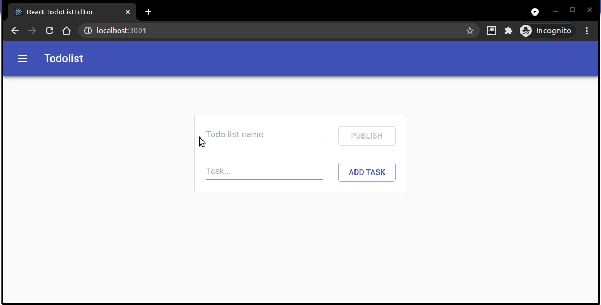

# TypeScript Todo list with Slim PHP backend

Self-hosted application for shared TODO lists (backend included). 
Each TODO is accessible on unique URL.




## Features
- create, edit and clone tasks
  - changing order (drag&drop)
  - inline edit
- saving tasks to localstorage (only for task owner)
- share task publicly via URL


## Technologies:

- React (TypeScript)
    - material UI
    - react router
    - notistack
- PHP
    - [SleekDb](https://sleekdb.github.io/) - for storing data
    - [Slim](https://www.slimframework.com/) - to easily API development 


### Installation - requirements
The application can be easily placed almost on any PHP hosting. 

### Installation (the short way)

Unzip [release](/releases) file to your server 

### Installation (the long way)

Build react GUI
```bash
cd client
npm run build
```

- copy content of /api to server
- copy content of /client/build to server
- copy /.htaccess to server

## Development

Run PHP server
```bash
php -S localhost:8889 -t ./api/public
```

Run React GUI
```bash
cd client
npm start
```

## Future

- [x] add created todo lists to localstorage (allow to access them)
- [x] add visited todo lists to logged users to history
- [ ] add user support
- [ ] allow edit task to task owner 
- [ ] allow writing notes and upload files for each todo list item
- [ ] add protected todo list with password

## Contributing
Pull requests are welcome. For major changes, please open an issue first to discuss what you would like to change.

Please make sure to update tests as appropriate.

## Support

Do you like this project? Just hit the star and follow me on github.

## License
[MIT](https://choosealicense.com/licenses/mit/)